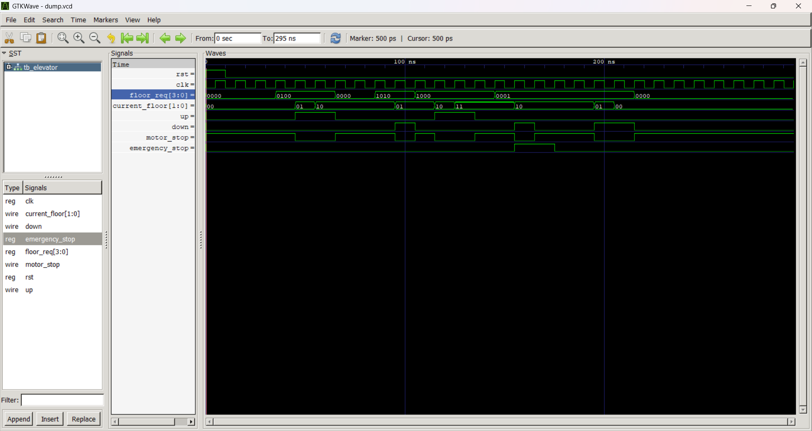

# RTL Elevator Controller

A 4-floor elevator controller designed in Verilog HDL using a finite state machine (FSM). The design handles floor requests, directional motor control, and an emergency stop with top priority, and is verified with a self-checking testbench.

## Features

- Supports 4 floors (0–3), selected via a one-hot `floor_req` input
- FSM-based control with four states: `IDLE`, `MOVE_UP`, `MOVE_DOWN`, `EMERGENCY`
- Emergency stop overrides all other states instantly, regardless of current motion
- Fixed floor-request priority: floor 0 > floor 1 > floor 2 > floor 3
- Synchronous active-high reset that returns the elevator to floor 0 and the `IDLE` state

## Module Interface

### `elevator`

| Port | Direction | Width | Description |
|---|---|---|---|
| `clk` | input | 1 | Clock signal |
| `rst` | input | 1 | Active-high synchronous reset |
| `emergency_stop` | input | 1 | Emergency stop request (highest priority) |
| `floor_req` | input | 4 | One-hot floor request: bit 0 = floor 0, bit 1 = floor 1, bit 2 = floor 2, bit 3 = floor 3 |
| `up` | output reg | 1 | High when the motor is moving up |
| `down` | output reg | 1 | High when the motor is moving down |
| `motor_stop` | output reg | 1 | High when the motor is stopped (idle or emergency) |
| `current_floor` | output reg | 2 | Current floor of the elevator (0–3) |

## FSM Description

The controller moves between four states based on the requested floor relative to the current floor:

- **IDLE** – Motor stopped. Moves to `MOVE_UP` if the target floor is above the current floor, or `MOVE_DOWN` if it's below.
- **MOVE_UP** – Current floor increments each clock cycle until it matches the target floor, then returns to `IDLE`.
- **MOVE_DOWN** – Current floor decrements each clock cycle until it matches the target floor, then returns to `IDLE`.
- **EMERGENCY** – Entered instantly from any state when `emergency_stop` is asserted; motor halts and stays halted until the signal is released, then returns to `IDLE`.

## Testbench

`tb_elevator.v` instantiates the `elevator` module and drives it through the following scenarios:

1. Reset behavior and initialization to floor 0
2. Direct floor request from floor 0 to floor 2
3. Simultaneous requests for floors 1 and 3 to confirm priority ordering (floor 1 is serviced first)
4. Emergency stop assertion mid-motion, followed by release and resumption to the pending target floor

Waveforms are dumped to `dump.vcd` for viewing in GTKWave.

## Files

| File | Description |
|---|---|
| `elevator.v` | RTL design of the elevator controller |
| `tb_elevator.v` | Testbench for functional verification |
| `elevator_wave.png` | Simulation waveform screenshot |

## Simulation

Using Icarus Verilog and GTKWave:

```bash
iverilog -o sim tb_elevator.v elevator.v
vvp sim
gtkwave dump.vcd
```

## Waveform



## Author

Tharaka Ramudu badugu
